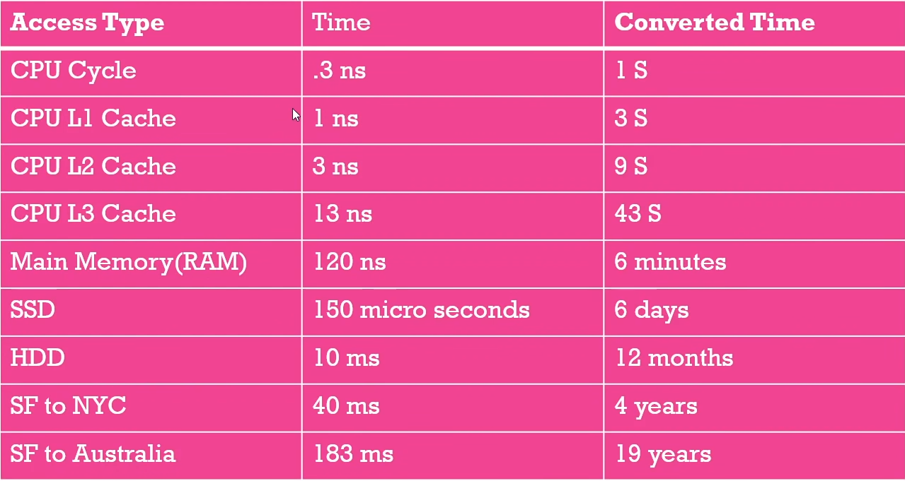

# system-design-basics

The whole note has been taken from this video: https://www.youtube.com/watch?v=MbjObHmDbZo

## Introduction

First rule is "whenever possible avoid using distributed system. Use it only when it is necesarry." What is a distributed system? Basicaly it is a group of computers working together and the goal is to hide the complexity from the user, so the user thinks he is interacting with a single computer.

### Falacies of distributed system

  1. Network is reliable.
  2. Topology does not change.( it always changes with adding or removing servers )
  3. Latency is zero.
  4. Network is secure.
  5. Bandwidth is infinite.
  6. Only one administrator.
  7. Transport cost of data is zero.

### Distributed system characteristics
  1. No shared clock.
  2. No shared memory. A part of system need to send request to another part of system for data.
  3. Shared resources. Anything is your distributed system should be able to be shared between nodes.
  4. Concurrency and consistency. Different part of system is working together and you need to make sure there is consystency among them.

### Distributed system communication
Different part of the system need to be able to talk. Requires agreed upon a format or protocol. Lot of things can go wrong, need to handle them somehow. 
  1. Client can't find the server.
  2. Server crash mid request.
  3. Server response is lost.
  4. Client crashes halfway throught the response so the server has nothing to send the response back to.

### Benefits of distributed system
  1. More reliable, fault tolerant.
  2. Scalibity.
  3. Lower latency, increased performance.
  4. Cost effective.

## Distributed System Performance Matrics

### Scalibity
  1. Ability of a system to grow and manage increased traffic.
  2. Increased volume of data or requests.

Bad design will fail with increasing traffic or increasing cost exponentially with linear incease of traffic.

### Reliability
  1. Probability of a system will fail during a period of time. 
  2. Harder to define with software than hardware. Do we consider slow response as failure? what is the threshold?

To ensure reliablity a lot of things need to be automated, like taking down a faulty server, predicting when a server may fail etc. A good indicator of relibality is Mean Time Between Failure ( MTBF ). \
MTBF = ( total_elapsed_time - total_down_time )/total_failure \
ex. ( 24h - 4h )/5 =  4h MTBF

### Availability
  1. Amount of time a system is opertional during a period of time.
  2. Poorly designed software which requires downtime for updates is less available.

availablity % = (available_time/total_time)*100 \
ex. (23h/24h)*100 = 95.83%

### Reliability vs Availability
  1. A reliable system is always an available system.
  2. Availability can be maintained by redundancy but system may not be reliable.
  3. Reliable software will always be more profitable. 

### Efficiency
  1. How well the system performs.
  2. Latency and throughput often used as metrics.

### Managability
  1. Speed and difficulty involved with managing the system.
  2. Observibility, how difficult it is to trace bugs.
  3. Difficulty in deploying updates.
  4. Want to abstract away the infrustracture so that the product engineers don't have to worry about it.

## Some Important Numbers

### Latency numbers

