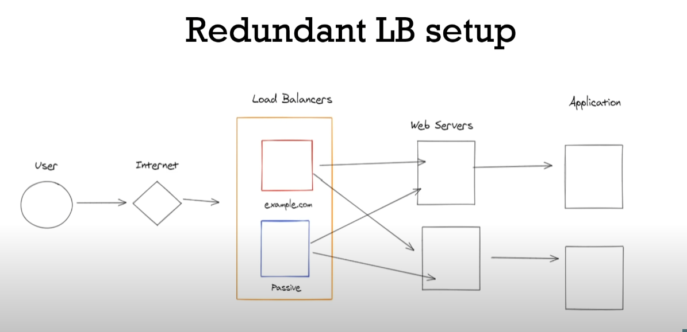

# system-design-basics

The whole note has been taken from this video: https://www.youtube.com/watch?v=MbjObHmDbZo

## Introduction

First rule is "whenever possible avoid using distributed system. Use it only when it is necesarry." What is a distributed system? Basicaly it is a group of computers working together and the goal is to hide the complexity from the user, so the user thinks he is interacting with a single computer.

### Falacies of distributed system

  1. Network is reliable.
  2. Topology does not change.( it always changes with adding or removing servers )
  3. Latency is zero.
  4. Network is secure.
  5. Bandwidth is infinite.
  6. Only one administrator.
  7. Transport cost of data is zero.

### Distributed system characteristics
  1. No shared clock.
  2. No shared memory. A part of system need to send request to another part of system for data.
  3. Shared resources. Anything is your distributed system should be able to be shared between nodes.
  4. Concurrency and consistency. Different part of system is working together and you need to make sure there is consystency among them.

### Distributed system communication
Different part of the system need to be able to talk. Requires agreed upon a format or protocol. Lot of things can go wrong, need to handle them somehow. 
  1. Client can't find the server.
  2. Server crash mid request.
  3. Server response is lost.
  4. Client crashes halfway throught the response so the server has nothing to send the response back to.

### Benefits of distributed system
  1. More reliable, fault tolerant.
  2. Scalibity.
  3. Lower latency, increased performance.
  4. Cost effective.

## Distributed System Performance Matrics

### Scalibity
  1. Ability of a system to grow and manage increased traffic.
  2. Increased volume of data or requests.

Bad design will fail with increasing traffic or increasing cost exponentially with linear incease of traffic.

### Reliability
  1. Probability of a system will fail during a period of time. 
  2. Harder to define with software than hardware. Do we consider slow response as failure? what is the threshold?

To ensure reliablity a lot of things need to be automated, like taking down a faulty server, predicting when a server may fail etc. A good indicator of relibality is Mean Time Between Failure ( MTBF ). \
MTBF = ( total_elapsed_time - total_down_time )/total_failure \
ex. ( 24h - 4h )/5 =  4h MTBF

### Availability
  1. Amount of time a system is opertional during a period of time.
  2. Poorly designed software which requires downtime for updates is less available.

availablity % = (available_time/total_time)*100 \
ex. (23h/24h)*100 = 95.83%

### Reliability vs Availability
  1. A reliable system is always an available system.
  2. Availability can be maintained by redundancy but system may not be reliable.
  3. Reliable software will always be more profitable. 

### Efficiency
  1. How well the system performs.
  2. Latency and throughput often used as metrics.

### Managability
  1. Speed and difficulty involved with managing the system.
  2. Observibility, how difficult it is to trace bugs.
  3. Difficulty in deploying updates.
  4. Want to abstract away the infrustracture so that the product engineers don't have to worry about it.

## Some Important Numbers

### Latency numbers

### Traffic estimates

#### Requests
avarage read requests = (average_daily_user * average_read_per_user)/86400 requests/sec \
avarage write requests = (average_daily_user * average_write_per_user)/86400 requests/sec 

ex. avarage read requests = (35000 x 10)/86400 ~ 4 requests/sec \
avarage write requests = (35000 x 2)/86400 ~ 1 requests/sec

#### Memory of cache server ( ram )
A general rule of thumb is that some of the data will get more attention ( thus will be cached ) and some of the data won't get any attention. On average 20%
of the read read requests data will be cached. Here request size only contains the data from database (ie. text data mainly) \
So, cache memory = read_requests_per_day * average_requests_size * 0.2 

ex. cache memory = 35000 x 10 x 10 KB x 0.2 = 700 MB ~ 1 GB

#### Bandwidth requirements
Here request size also contains the size of static files like photos from S3, files from CDN etc. \
bandwidth needed = (requests_per_day * request_size_in_MB )/86400  MB/sec 

ex. bandwidth needed = (35000 x 12  x 1.5 MB)/86400 ~ 7 MB/sec

This bandwidth estimation is the average bandwidth. Rule of thumb is that, at peak times bandwidth needs will be 3 times the average.

#### Storage requirements
Here request size contains the size of files and text data.
storage needed = write_request_per_day * request_size * life_expectancy_of_data

ex. storage needed = 35000 x 2 x 1.5 MB x (10x365) ~ 400000000 MB ~ 400 TB

### Scaling
#### Vertical scaling
This means increasing system hardware like ram, cpu cores or storage.
  1. Easiest way to scale.
  2. Diminishing returns, limits to scalibility.
  3. Single point of failure.
  
#### Horizontal scaling
  1. More complexity upfront, but more efficient long term.
  2. Redundancy built in.
  3. Need load balancer to distribute traffic.
  4. Cloud providers make this easier.

Basically rule of thumb is that intial cost with vertical scaling is lower than horizontal scaling but for higher demand than this, cost with horizontal scaling is way lower than vertical scaling. Also there is saturation point with vertical scaling. 

## System Design Components
### Load balancers
  1. Balance incoming traffic to multiple servers.
  2. It can be hardware or software based.
  3. Used to improve reliability and scalibity of the software.
  4. Common LB's are: Software based: Nginx, HAProxy Hardware based: F5, Citrix.

**LB routing methods:**
  1. Round Robin: uneven load because not all requests are same.
  2. Least Connection: Routes based on the number of client connected to the server.
  3. Least response time:
  4. IP Hash: usefull for stateful session.

**Layer 4 LB:**
  1. Only has access to TCP and UDP data. 
  2. Faster.
  3. Lack of Information can lead to uneven traffic.

**Layer 7 LB:**
  1. Full access to HTTP protocol and data.
  2. SSL termination.
  3. Check for authentication.
  4. Smarter routing options.

**A production LB setup:**

### Cache
it is a in-memory system. Most accessed data are normally cached. Suppose, your application is a food delivery system. Currently you have 1000 riders. So each time a rider query something about his daily target, direct database query can handle it. But If you want to scale it to 10000 riders, you can easily do it with caching, without any extra cost. Caching layers can be in front of many components, ex:
  1. DNS
  2. CDN
  3. Application
  4. Database

#### Distributed cache:
  1. Work same as traditional cache.
  2. Has builtin functionality to replicate data, shard data accross servers, and locate appropriate server for each key.
  3. Replication is done in similar active-passive system like LB.

#### Cache eviction
  1. Preventing stale data.
  2. Caching only the most valueable data.

#### Cache eviction policy
  1. TTL ( Time to live ): Set a time period before a cache entry is deleted. Used to prevent stale data.
  2. LRU ( Least recently used ): Once cache is full remove the last ( not recent ) accessed key and add new key. It has to do with keeping the most valueable items.
  3. LFU ( Least frequently used ): Track number of time a key is accessed. Drop least used when cache is full. It has to do with keeping the most valueable items.

#### Caching strategies
  1. Cache Aside: most common.
  2. Read Through.
  3. Write Through.
  4. Write Back

#### Cache consistency
  1. How to maintain consistency between cache and database efficiently.
  2. Importance depends on use case.
